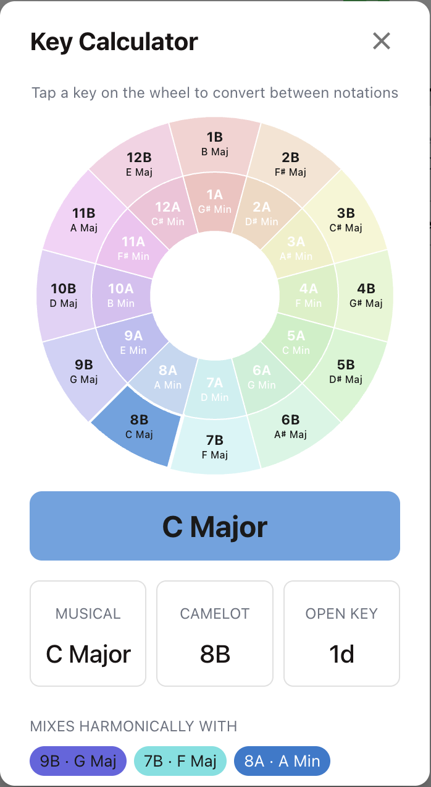
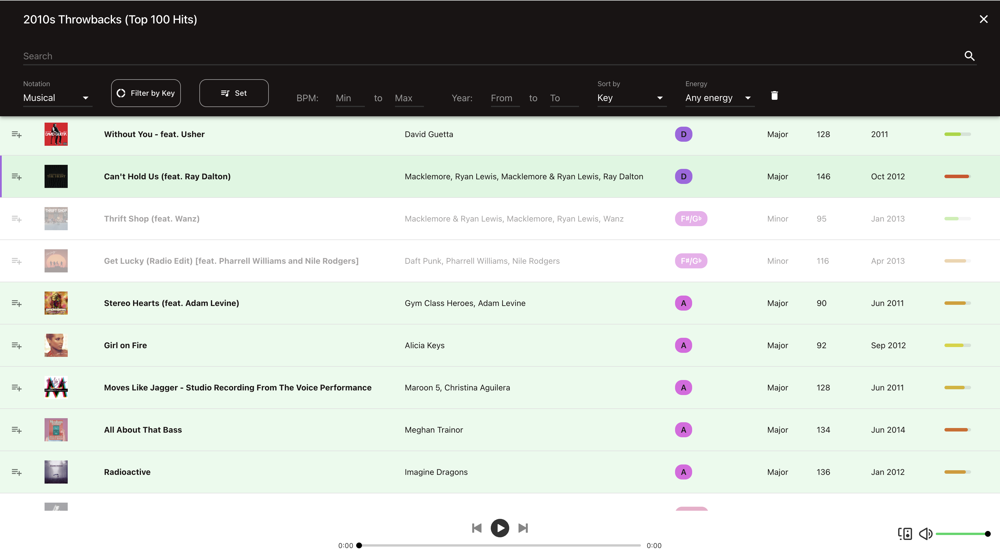
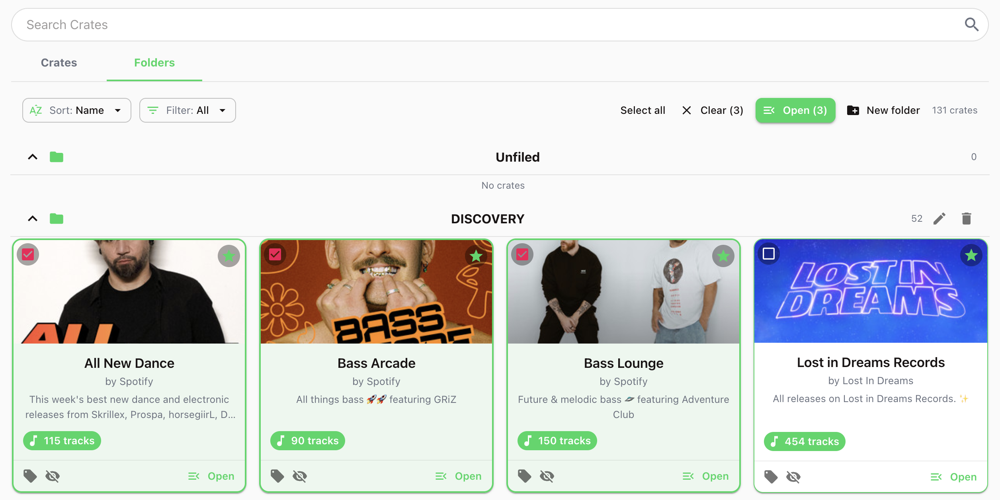
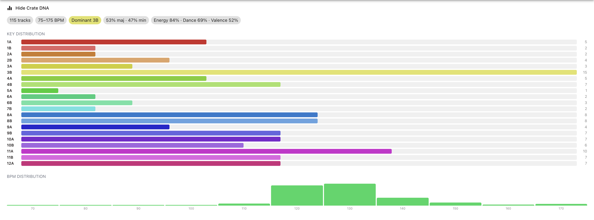
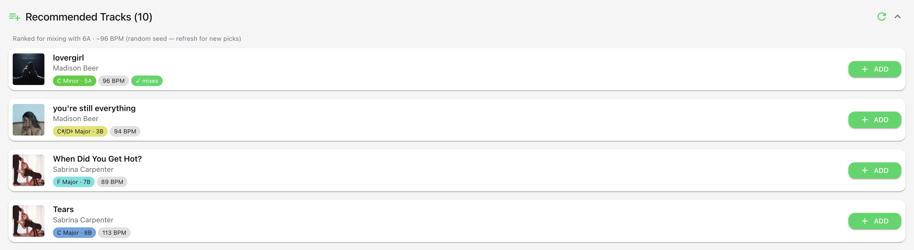
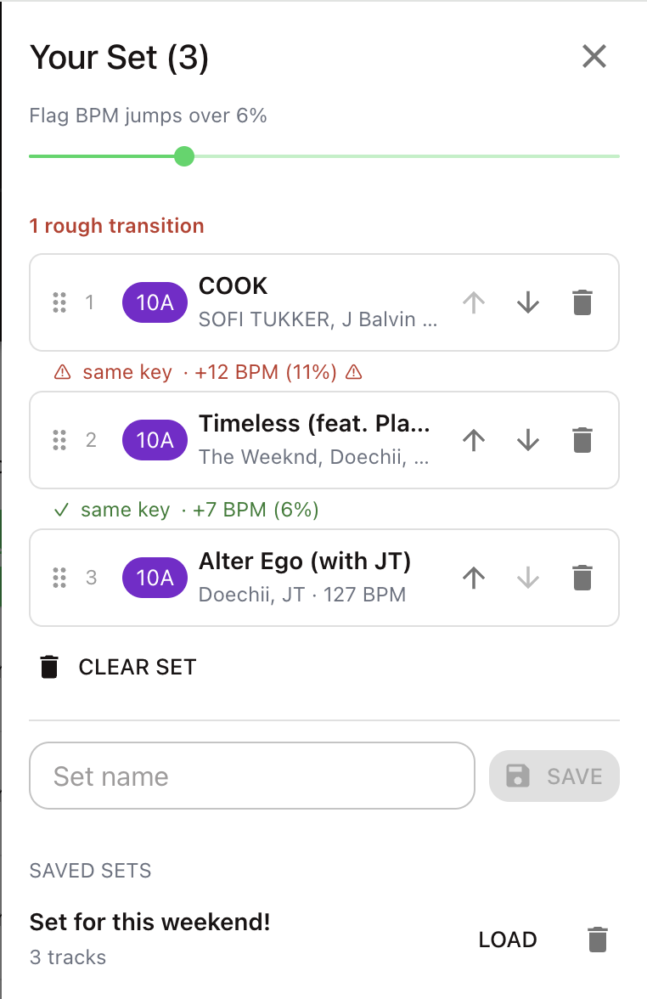
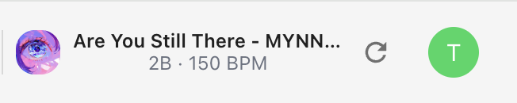

<div align="center">

# 🎧 KeyTrack

**Harmonic mixing intelligence for your Spotify crates.**

KeyTrack turns your Spotify library into a DJ's workspace — it reads the key, BPM, and energy of every track and lays them out so you can mix in key, dig through crates, and build sets, all in the browser.


<!-- 🎬 HERO GIF: drop a short screen-recording at docs/screenshots/demo.gif (e.g. opening the library, anchoring a key, watching matches light up). It will render right here. -->


</div>

---

## 💡 Why I built KeyTrack

This is a tool I began in 2019–2020 while I was still in college, to help me build sets for DJ gigs and shows. I always liked to save new music on Spotify through playlists, but when building setlists I found myself having to compile music and feed it into BPM/key detection or DJ software, which was very time consuming. KeyTrack started out as a fun side project to learn more about APIs and backends while doing something I loved.

I followed a Spotify Developer API tutorial on YouTube, then designed and created the very first few iterations of KeyTrack. Those early versions included the "Current Song" feature that could detect BPM and key for a song you were currently playing on Spotify, as well as pull your playlists and tracks and display their musical information on Material-UI surfaces. I built out the core of the search, filter, and backend server functionality between 2020 and 2025.

With the rise of AI and agentic coding, I was able to use Cursor in 2025 to build out a recommendations feature and redesign parts of the UI. And with Claude in 2026, I was able to do a full UI revamp and introduce a ton of new features I've always wanted to see.

It's a project I hold very dear to me, and I hope it's helpful to you! :)

Side note: Everything below here is written by Claude, at my guidance of course. 

---

## 🎚️ What KeyTrack can do

At its core, KeyTrack answers the question every DJ asks while digging: *"what mixes with this?"* It pulls Spotify's audio analysis for your tracks, translates it into the language DJs actually use — Camelot keys, BPM, energy — and gives you the tools to find, organize, and sequence music harmonically. Here's the full picture.

---

### 🎹 Read any track's key, BPM & notation

KeyTrack detects the **musical key and tempo** of every track from Spotify's audio features, then lets you read keys in whichever system you think in. Flip any key column between **Musical** (C, A♭m…), **Camelot** (8B, 5A…), and **Open Key** notation on the fly — no mental conversion required.

The standalone **Key Calculator** is an interactive Camelot wheel: tap a key and instantly see it in all three notations alongside its harmonic neighbors. It works without even logging in.



---

### 🔥 Mix in key, at a glance

Every key in your library is **color-coded by its Camelot position**, so compatible tracks visually rhyme. **Anchor a track** and KeyTrack lights up every harmonic match — same key, ±1 on the wheel, and the relative major/minor — while dimming the clashes. Pair that with the per-track **energy meter** and you can build a flow that's both in key and on vibe.



---

### 🗂️ Organize your crates the way you dig

Your playlists become a visual, cover-art **crate library** you can actually navigate. Switch between **Crates and Folders**, **sort / filter / search**, and tame big libraries with pagination. Make it yours with **tags, genres, favorites, hiding**, and **true folders**, and reach your **Liked Songs** as a crate of their own. Need to dig wide? **Tap crates to select them** (or *Select all*) and **open many at once** as a single combined view.



---

### 🧬 Understand a crate at a glance

Open **Crate DNA** to see a crate's character in seconds: its **key distribution** as Camelot bars, a **BPM histogram**, and a summary of track count, BPM range, dominant key, the major/minor split, and average energy, danceability, and valence. Sort and filter by **energy / vibe** or **release date** to zero in on exactly the right records.



---

### 💡 Get recommendations that actually mix

KeyTrack's **smart recommendations** don't just throw similar artists at you — they're **ranked by harmonic and BPM compatibility** to your anchored key (or seeded randomly when you're exploring), so suggestions are tracks you could genuinely drop next.



---

### 🧰 Build and validate your set

The **Set Builder** lets you assemble an ordered set pulling from *any* of your playlists. As you sequence, KeyTrack **validates each key + BPM transition** and flags the rough cuts before you ever hear them. **Save, load, and rename** named sets so your prep carries between sessions.



---

### 🎵 Listen and work without leaving the page

Play tracks **in the browser** via Spotify's Web Playback SDK, with a **slim Now Playing** control always in reach. The app ships with a **light/dark theme**, a desktop sidebar that becomes a mobile hamburger drawer, sleek micro-animations, and an in-app changelog.



---

## 🤖 How this app was built

KeyTrack started as a hand-built side project in 2020 and was rebuilt into the app it is today with AI assistance. Rather than count commits, here's the honest timeline of **when it was coded by hand vs. with AI help**:

| When | How it was built | What happened |
|---|---|---|
| **May 2020 – Jan 2022** | ✍️ **By hand** (no AI) | The original KeyTrack: Spotify login, the track table, key/BPM detection, filtering, chord progressions, and logout |
| **Nov 2025** | ⚡ **Hand + first AI assist** (Cursor) | A burst of additions — SoundCloud, a changelog, and a Cursor-assisted pass on recommendations, mobile layout, collapsible filters, and the musical-key UI |
| **Jun 2026** | 🤖 **AI agent** (Claude Code) | The modern app, v1.3.0 → v1.26.0: harmonic mixing, the Camelot wheel, the Set Builder, the full crate-management suite, folders, Crate DNA, energy/vibe, smarter recommendations, and the complete library redesign |

Work done with Claude Code carries a `🤖 Generated with Claude Code` footer on its pull requests, so the line between hand-written and AI-assisted is fully traceable in the history. The taste and direction stayed with the author throughout — KeyTrack is what that human-and-AI collaboration looks like in the open.

---

## 🚀 Local development

### Prerequisites
- **Node.js** v16+
- A **Spotify Developer** account, and **Spotify Premium** (required by the Web Playback SDK)

### 1. Register a Spotify app
At the [Spotify Developer Dashboard](https://developer.spotify.com/dashboard), create an app and add this **Redirect URI**:

```
http://127.0.0.1:8888/callback
```

> ⚠️ Spotify rejects `http://localhost` as an "insecure" redirect — use `127.0.0.1`.

Note your **Client ID** and **Client Secret**.

### 2. Configure the backend
```bash
cd local-server
cp .env.example .env        # then fill in SPOTIFY_ID and SPOTIFY_SECRET
npm install                 # first time only
npm start                   # serves on http://127.0.0.1:8888
```

### 3. Start the frontend
In a **new** terminal:
```bash
cd client
npm install                 # first time only
npm start                   # serves on http://localhost:3000
```

### 4. Use it
1. Open `http://localhost:3000`
2. Click **Log in with Spotify** (the **Key Calculator** works without logging in)
3. Open your **Library**, dig through crates by key / BPM / energy, build sets, and play tracks in-browser

---

## 🛠️ Tech stack

**Frontend** — React (Create React App), Material-UI v4, `spotify-web-api-js`, `react-spotify-web-playback`, Firebase / Firestore (saved sets + crate metadata), deployed to **Netlify**.

**Backend** — Node.js + Express handling the Spotify OAuth flow, deployed to **Heroku** (auto-deploys on merge to `master`).

---

## 🌐 Deployment

**Frontend (Netlify)** — continuous deployment from `master` via [`client/netlify.toml`](client/netlify.toml). Manual deploy:
```bash
cd client && npm run build && netlify deploy --prod   # publish dir: ./build
```

**Backend (Heroku)** — auto-deploys when `master` updates. For production set `SPOTIFY_ID`, `SPOTIFY_SECRET`, and `NODE_ENV=production`, and register the production `https://<your-app>/callback` redirect URI in the Spotify dashboard.

---

## 📄 License

MIT — see [`LICENSE`](local-server/LICENSE). Use it, fork it, mix with it.

## 👤 Author

**Tam Nguyen** · built with Spotify 🎵, Cursor ⚡, and Claude Code 🤖

---

<div align="center"><b>Happy mixing! 🎧✨</b></div>
